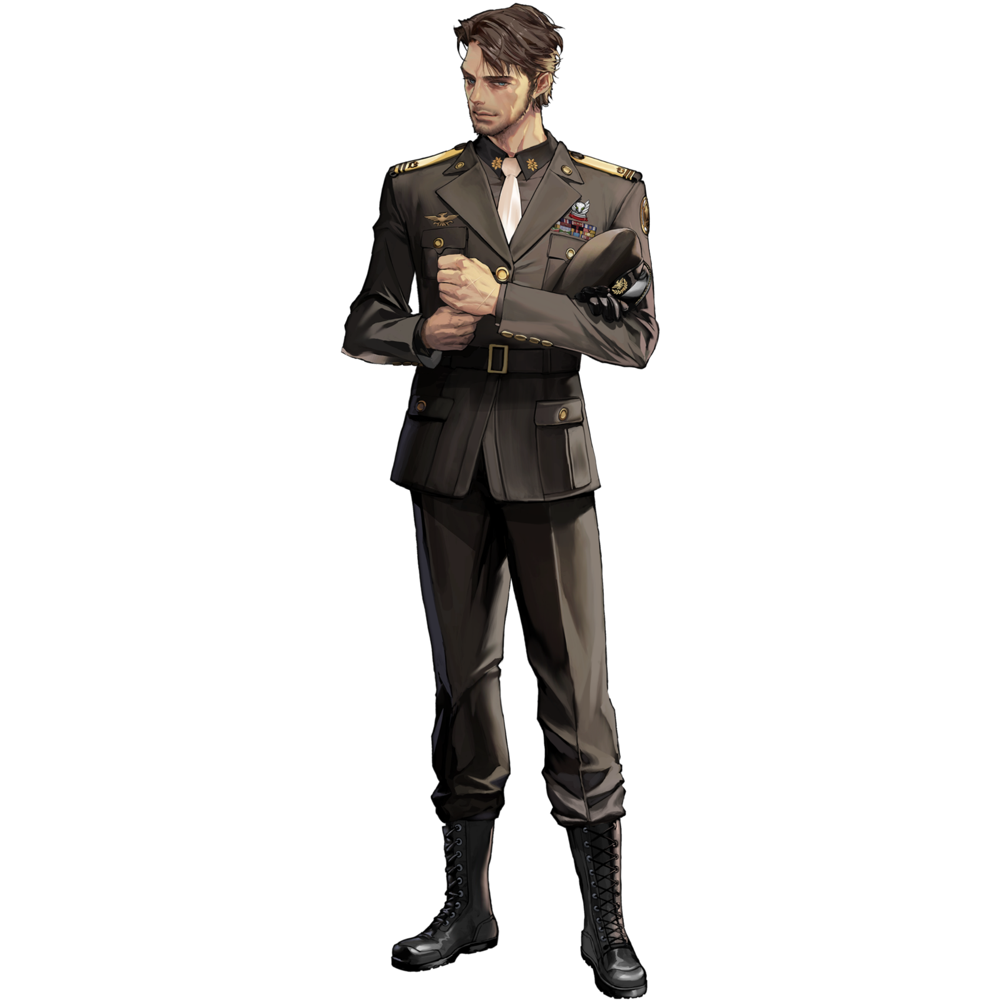
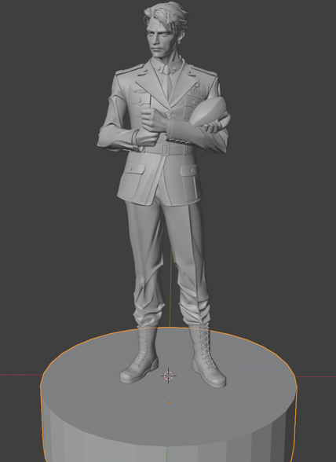
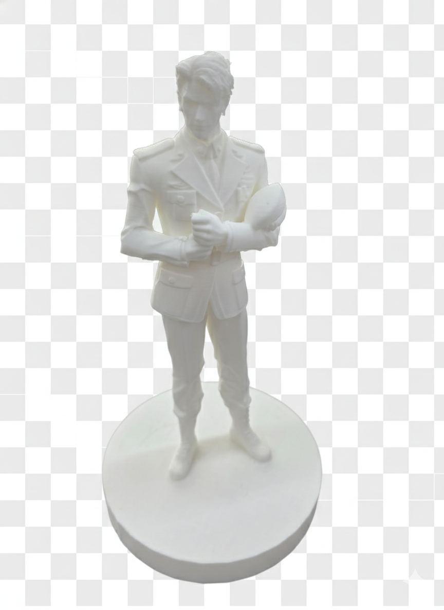

# Image to 3D Printing Workflow

This document describes the complete workflow for converting a 2D image into a 3D printed figure.

## Overview

| Step | Description | Tools |
|------|-------------|-------|
| 1 | Prepare Image | Background Removal (Segment Anything, rembg, Photoshop, etc.) |
| 2 | Generate 3D Model | Image-to-3D AI models |
| 3 | Edit 3D Model (Optional) | Blender, etc. |
| 4 | 3D Print | 3D Printer |

---

## Step 1: Prepare Image

Before generating a 3D model, you need to prepare your source image properly.

### Key Points:
- **Remove the background** - This is crucial for better 3D generation results. A clean, transparent background helps the AI model focus on the subject.
- **Use high-resolution images** - Higher quality input leads to better output.
- **Ensure clear subject boundaries** - The edges of your subject should be well-defined.

### Example - Original Image:

*The source image with background already removed (transparent PNG).*

---

## Step 2: Generate 3D Model

Use an Image-to-3D AI model to convert your 2D image into a 3D mesh.

### Recommended Tools:

| Model | Developer | Free |
|-------|-----------|------|
| [Hunyuan3D](https://github.com/Tencent/Hunyuan3D-2) | Tencent | O |
| [TRELLIS](https://github.com/microsoft/TRELLIS.2) | Microsoft | O |
| [VARCO 3D](https://3d.varco.ai/) | NCSOFT | X |
| [Sparc3D](https://github.com/lizhihao6/Sparc3D) | - | HuggingFace demo only |

### Multi-View Input (Advanced):
Modern Image-to-3D models support **multi-view image input** for better results:
- Front view
- Back view
- Left view
- Right view

### Quality Settings:
Adjust parameters like **octree resolution** to generate higher quality meshes with more faces. Higher resolution produces more detailed geometry but increases file size and processing time.

### Output Formats:
- `.obj`
- `.glb`
- `.fbx` 

---

## Step 3: Edit 3D Model (Optional)

After generating the 3D model, you may need to make adjustments using 3D modeling software.

### Common Modifications:
- **Add a base/pedestal** - For figures to stand properly
- **Fix mesh errors** - Close holes, fix non-manifold geometry
- **Scale adjustment** - Resize for your desired print size

### Example - Blender Editing:

*The 3D model imported into Blender with a cylindrical base added for stability. The base ensures the figure can stand on its own when printed.*

### Recommended Software:
- **Blender** (Free) - Full-featured 3D modeling

### Export for 3D Printing:
After editing in Blender, export your model as **STL format**:
1. Select the model in Blender
2. Go to `File` → `Export` → `STL (.stl)`
3. Configure export settings (apply modifiers, select only the object)
4. Save the file

> **Note:** STL is the standard format for 3D printing. Most 3D printers and slicing software accept STL files.

---

## Step 4: 3D Print

Use your exported STL file to print with a 3D printer.

### Example - Final 3D Printed Result:

*The finished 3D printed figure.*

### Tips:
- Place supports in easy-to-remove locations to minimize post-processing marks on visible surfaces.

---

